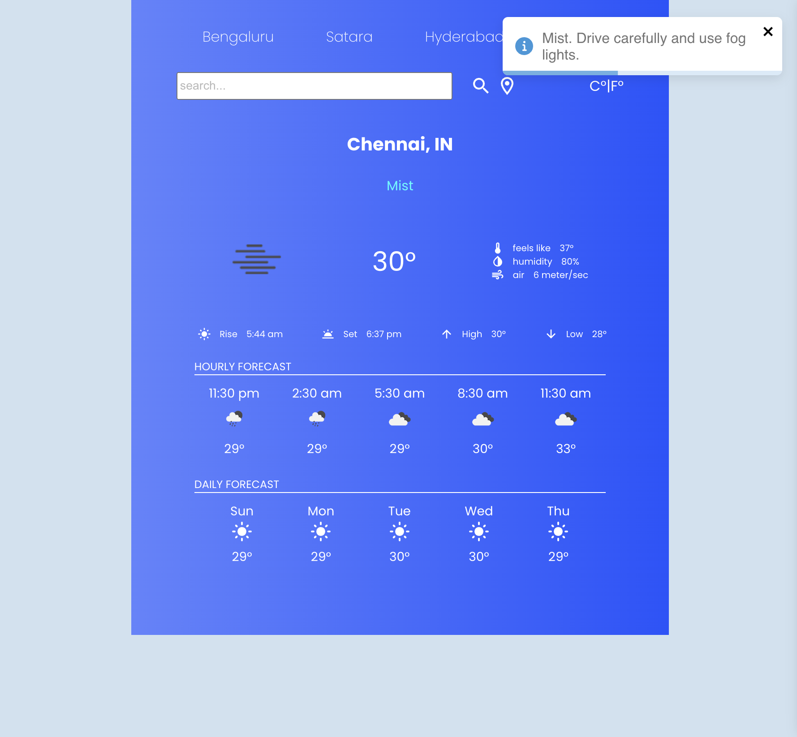

# React Weather App



A simple React application that displays current weather and forecasts based on OpenWeatherMap API.

## Features

- Display current weather conditions including temperature, humidity, wind speed, and weather icon.
- Show hourly forecasts for the next few hours.
- Present daily forecasts for the upcoming days.
- Change units between metric and imperial.
- Dynamic background color based on weather conditions.
- Actionable notifications based on weather status.

## Demo

You can see a live demo of the Weather App [here](https://your-weather-app-url).

## Getting Started

To get a local copy up and running follow these simple steps.

### Prerequisites

Make sure you have Node.js and npm installed.

### Installation

1. Clone the repo
   ```
   git clone https://github.com/preetsagar/weather-app.git
   cd weather-app
   ```
2. Install NPM packages
   ```
   npm install
   ```
3. Create a .env file in the root directory and add your OpenWeatherMap API key
   ```
   REACT_APP_API_KEY=your_openweathermap_api_key_here
   ```
4. Start the development server
   ```
   npm start
   ```
